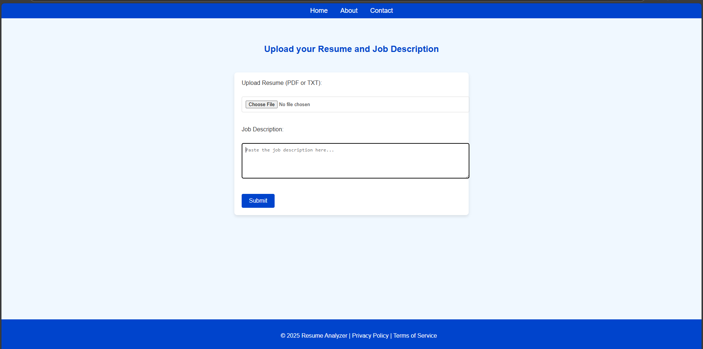

# Resume Analyzer Project

## Project Description
The **Resume Analyzer** is a web application that allows users to upload their resumes (in PDF or TXT format) and a job description. The app processes the resume and provides feedback on how well it matches the job description. It uses AI-powered analysis to improve the resume and highlight missing keywords from the job description.


## Example Screenshot



## Features
- Upload resumes in PDF or TXT format.
- Paste job description to compare with the uploaded resume.
- AI-powered analysis to improve resume content.
- User-friendly and interactive interface with a blue-themed UI.
- Display feedback and suggestions from the AI model.

## Technologies Used
- **Frontend**: HTML, CSS, JavaScript (AJAX for form submission).
- **Backend**: Python, FastAPI, Langchain.
- **AI**: (Gemini) used to analyze and compare resumes.
- **Libraries**: FastAPI, Langchain, Uvicorn, Python-dotenv, PyPDF2.
- **Hosting**: Local server (for testing purposes).

## Setup Instructions

### Prerequisites:
Ensure you have Python 3.8 or later installed on your system.

1. **Clone the Repository**:
   Clone the project repository to your local machine:
   ```bash
   git clone <repository_url>
   cd resume-analyzer
   ```

2. **Install Dependencies**:
   Install all required libraries and dependencies:
   ```bash
   pip install -r requirements.txt
   ```

3. **Run FastAPI Backend**:
   Start the FastAPI server:
   ```bash
   uvicorn main:app --reload
   ```
   The server will run at `http://localhost:8000`.

4. **Serve Frontend**:
   You can open the `index.html` file directly in a browser or serve it using a local server:
   ```bash
   python -m http.server 8001
   ```
   The frontend will be accessible at `http://localhost:8001`.

5. **Usage**:
   - Open `http://localhost:8001` in your browser.
   - Upload a resume (PDF or TXT format).
   - Paste a job description in the text area.
   - Click **Submit** to get the feedback from the AI.


## License
This project is licensed under the MIT License - see the [LICENSE](LICENSE) file for details.

---

## .gitignore

The following files and directories should be ignored by Git:

```
# Python
*.pyc
*.pyo
__pycache__/

# Virtual environment
venv/
*.env

# FastAPI
*.db
*.sqlite3

# VS Code
.vscode/

# Logs
*.log
```

